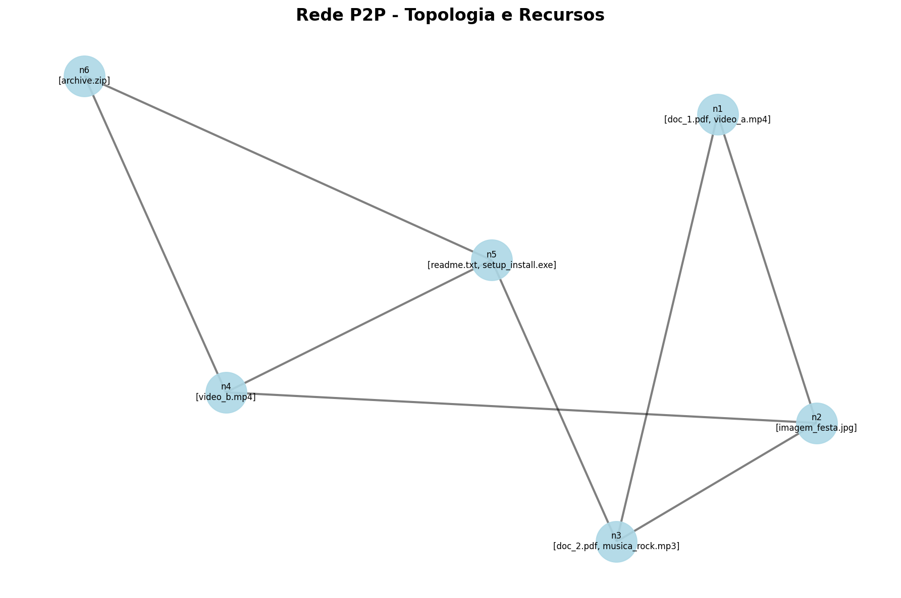

# Implementação de Algoritmos de Busca em Sistemas P2P

Este projeto implementa uma simulação de uma rede Peer-to-Peer (P2P) não estruturada, permitindo a execução e comparação de diferentes algoritmos de busca de recursos (Flooding e Random Walk), incluindo suas variantes informadas (com cache).

## 1. Identificação da Equipe
*   Pedro Augusto De Oliveira Neto - 2224213
*   Francisco Dantas Da Silva Neto - 2223879
*   Natanael Freitas De Azevedo - 2224186

## 2. Principais Funcionalidades

O software foi desenvolvido em **Python** e opera através de linha de comando (CLI). Suas principais capacidades incluem:

*   **Carregamento de Topologia:** Leitura de arquivos de configuração (`.json`) que definem nós, vizinhos (arestas) e recursos disponíveis em cada nó.
*   **Validação da Rede:** Verificação automática de integridade, garantindo que o grafo seja conexo (sem partições), não contenha laços (self-loops) e respeite os limites mínimos e máximos de vizinhos.
*   **Algoritmos de Busca:**
    *   **Flooding (Inundação):** Propaga a busca para todos os vizinhos até encontrar o recurso ou esgotar o TTL. Garante encontrar o caminho, mas gera alto tráfego.
    *   **Random Walk (Passeio Aleatório):** Envia a busca para apenas um vizinho aleatório por vez. Reduz o tráfego, mas pode demorar mais para encontrar recursos distantes.
    *   **Variantes Informadas:** Ambos os algoritmos possuem versões "Informed" que utilizam um cache local para armazenar a localização de recursos previamente encontrados, acelerando buscas futuras.
*   **Métricas de Desempenho:** Para cada busca, o sistema relata se houve sucesso, o número total de mensagens trocadas e a quantidade de nós distintos envolvidos.

## 3. Resultados dos Testes Comparativos

Abaixo estão os resultados obtidos executando os algoritmos na topologia de teste definida em `config.json`.

### Topologia da Rede

A rede P2P utilizada nos testes possui 6 nós conectados conforme o diagrama abaixo:



**Para gerar esta imagem, execute:**
```bash
python p2p.py config.json visualize network_topology.png
```

### Tabela de Resultados

| Cenário | Algoritmo | Origem → Destino | Msgs Trocadas | Nós Envolvidos | Caminho Encontrado | Observação |
| :--- | :--- | :--- | :--- | :--- | :--- | :--- |
| **Recurso Próximo** | Flooding | n1 → n2 | 2 | 2 | `n1 -> n2` | Eficiente para vizinhos diretos. [1] |
| **Recurso Distante** | Flooding | n1 → n6 | 8 | 6 | `n1 -> n2 -> n4 -> n6` | Inundou a rede inteira (6 nós) para achar o alvo. [2] |
| **Recurso Distante** | Random Walk | n1 → n6 | 5 | 4 | `n1->n2->n1->n2->n4->n6` | Menos nós envolvidos que o Flooding, mas caminho redundante. [3] |

### Análise dos Dados
*   **Flooding em Recurso Distante:** O algoritmo garantiu o menor caminho lógico (`n1->n2->n4->n6`), mas ao custo de envolver **100% da rede** (6 de 6 nós) e gerar o maior número de mensagens (8). Isso confirma a característica de alto tráfego do algoritmo.[2]
*   **Random Walk em Recurso Distante:** O algoritmo utilizou menos mensagens (5) e incomodou menos nós (4) do que a inundação. No entanto, o caminho foi errático, visitando o nó `n2` múltiplas vezes (`n1->n2->n1->n2...`) antes de avançar, demonstrando a aleatoriedade do processo.[3]

## Como Executar

### Pré-requisitos
*   Python 3.x instalado
*   Bibliotecas necessárias:
    ```bash
    pip install networkx matplotlib pillow
    ```
    Ou instale todas as dependências de uma vez:
    ```bash
    pip install -r requirements.txt
    ```

### Sintaxe Geral

```bash
python p2p.py <config.json> [comando] [argumentos...]
```

### Comandos Disponíveis

#### 1. Visualizar a Topologia da Rede

**Exibir interativamente:**
```bash
python p2p.py config.json visualize
```

**Salvar como imagem PNG:**
```bash
python p2p.py config.json visualize network_topology.png
```

Este comando gera um gráfico visual da rede mostrando todos os nós, suas conexões (arestas) e os recursos disponíveis em cada nó.

#### 2. Busca de Recursos (Modo Texto)

**Sintaxe completa:**
```bash
python p2p.py config.json search <node_id> <resource_id> <ttl> <algoritmo>
```

**Sintaxe simplificada (atalho):**
```bash
python p2p.py config.json <node_id> <resource_id> <ttl> <algoritmo>
```

**Exemplos:**

```bash
# Flooding - Recurso Próximo
python p2p.py config.json n1 imagem_festa.jpg 5 flooding

# Flooding - Recurso Distante
python p2p.py config.json n1 archive.zip 5 flooding

# Random Walk - Recurso Distante
python p2p.py config.json n1 archive.zip 20 random_walk

# Busca Informada (com cache) - Flooding
python p2p.py config.json n1 archive.zip 5 informed_flooding

# Busca Informada (com cache) - Random Walk
python p2p.py config.json n1 archive.zip 20 informed_random_walk
```

**Saída esperada:**
```
Encontrado: True
Mensagens trocadas: 8
Nós envolvidos: 6
Caminho: n1 -> n2 -> n4 -> n6
```

#### 3. Busca com Animação Visual

**Exibir animação interativa:**
```bash
python p2p.py config.json animate <node_id> <resource_id> <ttl> <algoritmo>
```

**Salvar animação como GIF:**
```bash
python p2p.py config.json animate <node_id> <resource_id> <ttl> <algoritmo> <output.gif>
```

**Exemplos:**

```bash
# Animação de busca por Flooding (exibir na tela)
python p2p.py config.json animate n1 archive.zip 5 flooding

# Salvar animação de Random Walk como GIF
python p2p.py config.json animate n1 archive.zip 20 random_walk busca_random_walk.gif

# Animação de busca informada
python p2p.py config.json animate n1 imagem_festa.jpg 5 informed_flooding busca_informada.gif
```

A animação mostra visualmente:
- **Nó laranja:** Nó de origem
- **Nós amarelos:** Nós visitados durante a busca
- **Nó verde:** Nó que possui o recurso procurado
- **Linhas vermelhas:** Caminho percorrido até o momento
- **Informações:** TTL, mensagens trocadas, nós envolvidos

#### 4. Algoritmos Disponíveis

| Algoritmo | Descrição | Uso Recomendado |
|:----------|:----------|:----------------|
| `flooding` | Inundação - propaga para todos os vizinhos | Garantir encontrar o recurso |
| `informed_flooding` | Flooding com cache | Buscas repetidas, otimizar flooding |
| `random_walk` | Passeio aleatório - escolhe vizinho aleatório | Reduzir tráfego de rede |
| `informed_random_walk` | Random walk com cache | Buscas repetidas, otimizar random walk |

### Exemplos Práticos de Uso

#### Cenário 1: Comparar algoritmos para o mesmo recurso

```bash
# Teste com Flooding
python p2p.py config.json n1 archive.zip 5 flooding

# Teste com Random Walk
python p2p.py config.json n1 archive.zip 20 random_walk

# Compare mensagens trocadas e nós envolvidos
```

#### Cenário 2: Gerar visualizações para documentação

```bash
# 1. Gerar topologia da rede
python p2p.py config.json visualize topology.png

# 2. Gerar animação de busca por Flooding
python p2p.py config.json animate n1 archive.zip 5 flooding flooding_search.gif

# 3. Gerar animação de busca por Random Walk
python p2p.py config.json animate n1 archive.zip 20 random_walk random_walk_search.gif
```

#### Cenário 3: Testar busca informada (cache)

```bash
# Primeira busca (popula o cache)
python p2p.py config.json n1 archive.zip 5 informed_flooding

# Segunda busca do mesmo recurso (usa o cache)
python p2p.py config.json n3 archive.zip 5 informed_flooding
# Observe a redução significativa em mensagens trocadas!
```

### Automação de Testes

Para automação completa dos testes e geração de logs:
```bash
# Em ambientes Unix/Linux/macOS/Git Bash
chmod +x testes.sh
./testes.sh
```

### Parâmetros Importantes

- **`<node_id>`**: Identificador do nó de origem (ex: `n1`, `n2`, etc.)
- **`<resource_id>`**: Nome do recurso procurado (ex: `archive.zip`, `imagem_festa.jpg`)
- **`<ttl>`**: Time-To-Live - número máximo de saltos permitidos na busca
  - Flooding geralmente precisa de TTL menor (5-10)
  - Random Walk pode precisar de TTL maior (20-50)
- **`<algoritmo>`**: Um dos quatro algoritmos disponíveis (veja tabela acima)